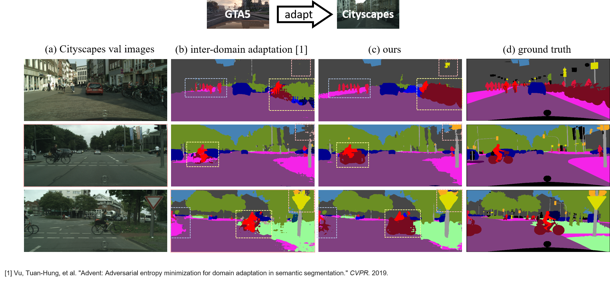
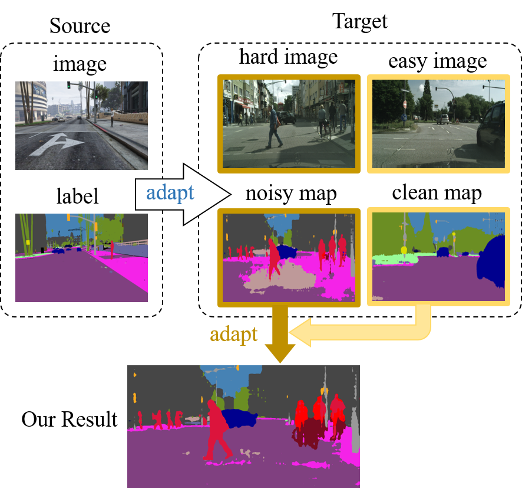
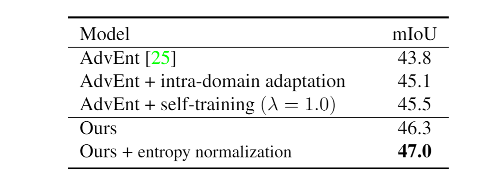
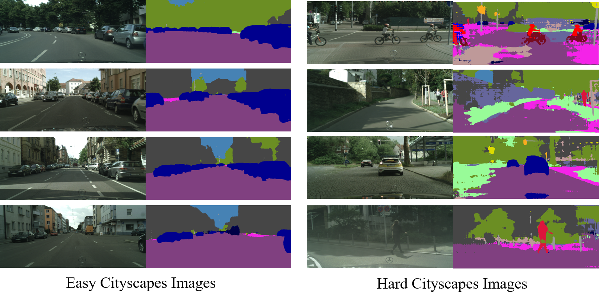

# Unsupervised Intra-domain Adaptation for Semantic Segmentation through Self-Supervision


[[Project Page]](https://feipanir.github.io/IntraDA/) [[Presentation]](https://youtu.be/x1KLka4iQlo) [[DemoVideo]](https://youtu.be/Cy71aWeHQe4) [[讲演视频]](https://www.bilibili.com/video/BV1NZ4y1H7RC/) [[效果演示]](https://www.bilibili.com/video/BV1QK4y1x7oA/)
 
### CVPR 2020 Oral


<p align="center">
        
</p>


## Paper
[Unsupervised Intra-domain Adaptation for Semantic Segmentation through Self-Supervision](http://arxiv.org/abs/2004.07703)

Fei Pan, Inkyu Shin, Francois Rameau, Seokju Lee, In So Kweon

KAIST, Korea

IEEE Conference on Computer Vision and Pattern Recoginition (CVPR), 2020 (**Oral**)

If you find this paper or code useful for your research, please cite our paper:
```
@InProceedings{pan2020unsupervised,
  title = {Unsupervised Intra-domain Adaptation for Semantic Segmentation through Self-Supervision},
  author = {Pan, Fei and Shin, Inkyu and Rameau, Francois and Lee, Seokju and Kweon, In So},
  booktitle = {IEEE Conference on Computer Vision and Pattern Recoginition (CVPR)},
  year = {2020}
}
```

<p align="center">
        
</p>


## Abstract 
<p align="justify">
Convolutional neural network-based approaches have achieved remarkable progress in semantic segmentation. However, these approaches heavily rely on annotated data which are labor intensive. To cope with this limitation, automatically annotated data generated from graphic engines are used to train segmentation models. However, the models trained from synthetic data are difficult to transfer to real images. To tackle this issue, previous works have considered directly adapting models from the source data to the unlabeled target data (to reduce the inter-domain gap). Nonetheless, these techniques do not consider the large distribution gap among the target data itself (intra-domain gap). In this work, we propose a two-step self-supervised domain adaptation approach to minimize the inter-domain and intra-domain gap together. First, we conduct the inter-domain adaptation of the model; from this adaptation, we separate the target domain into an easy and hard split using an entropy-based ranking function. Finally, to decrease the intra-domain gap, we propose to employ a self-supervised adaptation technique from the easy to the hard split. Experimental results on numerous benchmark datasets highlight the effectiveness of our method against existing state-of-the-art approaches.
</p>

### Acknowledgement
This work is supported by [BOSCH](https://www.bosch.com/).

This repo is heavily borrowed from [ADVENT](https://github.com/valeoai/ADVENT.git), [AdaptSegNet](https://github.com/wasidennis/AdaptSegNet), and [Pytorch-Deeplab](https://github.com/speedinghzl/Pytorch-Deeplab).

## Pre-requsites
* Python 3.7
* Pytorch >= 0.4.1
* CUDA 9.0 or higher

## Installation
0. Clone the repo:
```bash
$ git clone https://github.com/feipanir/IntraDA.git
$ cd IntraDA
```

1. Install OpenCV if you don't already have it:
```bash
$ conda install -c menpo opencv
```
if it doesn't work, please try to use conda pip
```bash
$ which pip    # should be $HOME/anaconda3/bin/pip, be sure to use conda pip
$ pip install opencv-python 
```

2. Install ADVENT submodule and the dependices using pip:
if you use 
```bash
$ pip install -e <root_dir/ADVENT>
```
With this, you can edit the ADVENT code on the fly and import function 
and classes of ADVENT in other project as well.

### Datasets
We follow set-ups from [ADVENT](https://github.com/valeoai/ADVENT.git). The datasets are put into ```<root_dir>/ADVENT/data```. Symlinks to hook the ADVENT codebase to the dataset is recommended. An alternative option is to explicitlly specify the parameters ```DATA_DIRECTORY_SOURCE``` and ```DATA_DIRECTORY_TARGET``` in YML configuration files.

**GTA5**: Please follow the instructions [here](https://download.visinf.tu-darmstadt.de/data/from_games/) to download images and semantic segmentation annotations. The GTA5 dataset directory should have this basic structure:
```bash
<root_dir>/ADVENT/data/GTA5/                               % GTA dataset root
<root_dir>/ADVENT/data/GTA5/images/                        % GTA images
<root_dir>/ADVENT/data/GTA5/labels/                        % Semantic segmentation labels
...
```

**Cityscapes**: Please follow the instructions in [Cityscape](https://www.cityscapes-dataset.com/) to download the images and validation ground-truths. The Cityscapes dataset directory should have this basic structure:
```bash
<root_dir>/ADVENT/data/Cityscapes/                         % Cityscapes dataset root
<root_dir>/ADVENT/data/Cityscapes/leftImg8bit              % Cityscapes images
<root_dir>/ADVENT/data/Cityscapes/leftImg8bit/val
<root_dir>/ADVENT/data/Cityscapes/gtFine                   % Semantic segmentation labels
<root_dir>/ADVENT/data/Cityscapes/gtFine/val
...
```

### Pretrained and evaluation models
Please download the [pretrained model](https://1drv.ms/u/s!AthTAwNfTh-YhkyC7XOGHUEwxtk7?e=tid19j) and put in ```<root_dir>/ADVENT/pretrained_models```. And please download the [evaluation models](https://1drv.ms/u/s!AthTAwNfTh-Yhkt8qVVtIUCT5g4l?e=yKffxB) for evaluation process. Moreover, the trained AdvEnt model is shared [here](https://github.com/valeoai/ADVENT/releases/download/v0.1/gta2cityscapes_advent.pth).


### Running the code
For evaluation, execute:
```bash
$ cd <root_dir>/intrada
$ python test.py --cfg intrada_trained.yml 
$ python test.py --cfg intrada_trained_withnorm.yml # test on models trained wih entropy normalization
```

### Training
Our training environment is based on pytorch 0.4.1 and CUDA 9.0. To reach to the comparable performance you may need to train a few times.
By default, logs and snapshots are stored in ```<root_dir>/experiments``` with this structure:
```bash
<root_dir>/ADVENT/experiments/logs
<root_dir>/ADVENT/experiments/snapshots
```

**Step 1.** Conduct inter-domain adaptation by training [ADVENT](https://github.com/valeoai/ADVENT.git): 
```bash
$ cd <root_dir>/ADVENT/advent/scripts
$ python train.py --cfg ./config/advent.yml 
$ python train.py --cfg ./config/advent.yml --tensorboard % using tensorboard
```
After inter-domain training, it is needed to get best IoU iteration by runing:
```bash
$ cd <root_dir>/ADVENT/advent/scripts
$ python test.py --cfg ./config/advent.yml
```
The best IoU iteration ```BEST_ID``` will be a parameter to **step 2**. 

**Step 2.** Entropy-based ranking to split Cityscapes training set into easy split and hard split: 
```bash
$ cd <root_dir>/entropy_rank
$ python entropy.py --best_iter BEST_ID --normalize False --lambda1 0.67 
```
You will see the pseudo labels generated in ```color_masks```, the easy split file names in ```easy_split.txt```, and the hard split file names in ```hard_split.txt```.

**Step 3.** Conduct intra-domain adaptation by runing:
```bash
$ cd <root_dir>/intrada
$ python train.py --cfg ./intrada.yml
$ python train.py --cfg ./intrada.yml --tensorboard % using tensorboard
```

## Testing
To test the performance from intrada, run:
```bash
$ cd <root_dir>/intrada
$ python test.py --cfg ./intrada.yml
```

### Quantitative Results

<p align="center">
        
</p>

### Some Samples from Easy and Hard Split

<p align="center">
        
</p>

## Related works
[1] Tsai, Yi-Hsuan, et al. "Learning to adapt structured output space for semantic segmentation." Proceedings of the IEEE Conference on Computer Vision and Pattern Recognition. 2018.

[2] Vu, Tuan-Hung, et al. "Advent: Adversarial entropy minimization for domain adaptation in semantic segmentation." Proceedings of the IEEE Conference on Computer Vision and Pattern Recognition. 2019. 

## License
IntraDA is released under [MIT License](./LICENSE).
